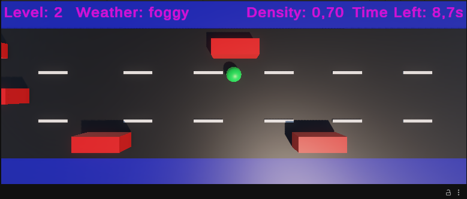

# Traffic Simulation

Simulação de travessia de pedestre com tráfego e clima dinâmicos baseados em dados de um mock local.



---

## Como Executar?

1. Abra o projeto na Unity
2. Abra a cena: Assets/Scenes/MainScene
3. Clique em Play  
4. Use as **setas do teclado** para mover o jogador

---

## Mock da API

Arquivo local utilizado como fonte de dados: Assets/StreamingAssets/traffic_data.json

- `predicted_status`: mudanças futuras

---

# Lógica do Jogo

- **Spawn de veículos:**  
  `intervalo = 1 / vehicleDensity`

- **Velocidade dos veículos:**  
  `velocidade = (averageSpeed / 100) * referenceSpeed`

- **Clima afeta o jogador:**

| Clima         | Velocidade   |
|---------------|--------------|
| sunny         | 1.0x         |
| clouded/foggy | 0.8x         |
| light rain    | 0.6x         |
| heavy rain    | 0.4x         |

- Predições são aplicadas automaticamente com base em `estimated_time`

---

## Regras

- Evite colisões  
- Atravesse antes do tempo acabar  
- Ao chegar no final → próximo estado é aplicado (loop contínuo)

---

## Estrutura

```text
Scripts/
├── Core/
|  └── GameManager.cs
|
├── Data/
|  ├── APIService.cs
|  └── TrafficData.cs
|
├── Gameplay/
|  ├── Environment/
|  |  └── FinishZone.cs
|  |
|  ├── Player/
|  |  ├── PlayerCollision.cs
|  |  └── PlayerController.cs
|  |
|  └── Traffic/
|    ├── TrafficSpawner.cs
|    └── Vehicle.cs
|
├── Systems/
|  └── PredictionScheduler.cs
|
└── UI/
  ├── GameOverUI.cs
  └── HUDController.cs
```

---

## Melhorias Futuras

- Implementação de interfaces (SOLID) para desacoplamento entre serviços
- Integração com API real via HTTP (substituindo o mock local)
